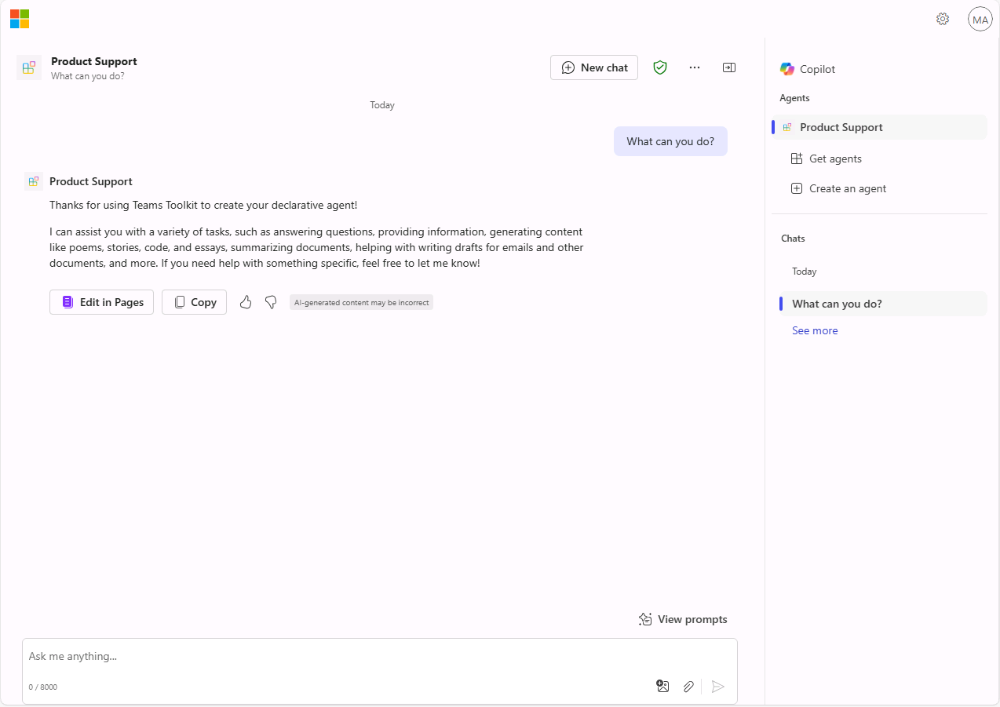

---
lab:
    title: 'Exercise 1 - Create a declarative agent in Visual Studio Code'
    module: 'LAB 01: Build a declarative agent for Microsoft 365 Copilot using Visual Studio Code'
---

# Exercise 1 - Create a declarative agent

In this exercise, you will create a declarative agent project from a template, update the manifest, upload the agent to Microsoft 365, and test the agent in Microsoft 365 Copilot. 

A declarative agent is implemented in a Microsoft 365 app. You create an app package which contains:

- app.manifest.json: The app manifest file describes how your app is configured, including its capabilities.
- declarative-agent.json: The declarative agent manifest describes how your declarative agent is configured.
- color.png and outline.png: A color and outline icon used to represent your declarative agent in the Microsoft 365 Copilot user interface.

### Exercise Duration

- **Estimated Time to complete**: 15 minutes

## Task 1 - Enable custom app uploads in Teams admin center

To upload declarative agents to Microsoft 365 through Teams Toolkit, you'll need to enable **Custom app uploads** in the Teams admin center.

1. Navigate to Teams apps > App setup policies in the Teams admin center or go directly to [App setup policies](https://admin.teams.microsoft.com/policies/app-setup).
1. Select **Global (Org-wide default)** from the list of policies.
1. Turn on **Upload custom apps**.
1. Select **Save** and then **Confirm** your choice.

## Task 2 - Download the starter project

Start by downloading the sample project from GitHub in a web browser:

1. Navigate to [https://github.com/microsoft/learn-declarative-agent-vscode](https://github.com/microsoft/learn-declarative-agent-vscode) template repository.
    1. Follow the steps to [download the repository source code](https://docs.github.com/repositories/working-with-files/using-files/downloading-source-code-archives#downloading-source-code-archives-from-the-repository-view) to your computer.
    1. Extract the contents of the downloaded ZIP file and extract it to your **Documents folder**.

The starter project contains a Teams Toolkit project that includes a declarative agent.

1. Open the project folder in Visual Studio Code.
1. In the project root folder, open **README.md** file. Examine the contents for more information about the project structure.


## Task 3 - Examine declarative agent manifest

Let's examine the declarative agent manifest file:

- Open the **appPackage/declarativeAgent.json** file and examine the contents:

    ```json
    {
        "$schema": "https://aka.ms/json-schemas/agent/declarative-agent/v1.0/schema.json",
        "version": "v1.0",
        "name": "da-product-support",
        "description": "Declarative agent created with Teams Toolkit",
        "instructions": "$[file('instruction.txt')]"
    }
    ```

The value of the **instructions** property contains a reference to a file named **instruction.txt**. The **$[file(path)]** function is provided by Teams Toolkit. The contents of the **instruction.txt** are included in the declarative agent manifest file when provisioned to Microsoft 365.

- In the **appPackage** folder, open **instruction.txt** file and review the contents:

    ```md
    You are a declarative agent and were created with Team Toolkit. You should start every response and answer to the user with "Thanks for using Teams Toolkit to create your declarative agent!\n\n" and then answer the questions and help the user.
    ```

## Task 4 - Update the declarative agent manifest

Let’s update the **name** and **description** properties to be more relevant to our scenario.

1. In the **appPackage** folder, open **declarativeAgent.json** file.
1. Update the **name** property value to **Microsoft 365 Knowledge Expert**.
1. Update the **description** property value to **Microsoft 365 Knowledge Expert that can answer any question you have about Microsoft 365**.
1. Save your changes

The updated file should have the following contents:

```json
{
    "$schema": "https://aka.ms/json-schemas/agent/declarative-agent/v1.0/schema.json",
    "version": "v1.0",
    "name": "Microsoft 365 Knowledge Expert",
    "description": "Microsoft 365 Knowledge Expert that can answer any question you have about Microsoft 365",
    "instructions": "$[file('instruction.txt')]"
}
```

## Task 5 - Upload the declarative agent to Microsoft 365

Next, upload your declarative agent to your Microsoft 365 tenant.

In Visual Studio Code:

1. In the **Activity Bar**, open the **Teams Toolkit** extension.

    

1. In the **Lifecycle** section, select **Provision**.

    

1. In the prompt, select **Sign in** and follow the prompts to sign in to your Microsoft 365 tenant using Teams Toolkit. The provisioning process starts automatically after you sign in.

    

    

1. Wait for the upload to complete before continuing.

    

Next, review the output of the provisioning process.

- In the **appPackage/build** folder, open **declarativeAgent.dev.json** file.

Notice that the **instructions** property value contains the contents of the **instruction.txt** file. The **declarativeAgent.dev.json** file is included in the **appPackage.dev.zip** file along with the **manifest.dev.json**, **color.png**, and **outline.png** files. The **appPackage.dev.zip** file is uploaded to Microsoft 365.

## Task 6 - Test the declarative agent in Microsoft 365 Copilot Chat

Next, let’s run the declarative agent in Microsoft 365 Copilot Chat and validate its functionality.

1. In the **Activity Bar**, open the **Teams Toolkit** extension.

    

1. In the **Lifecycle** section, select **Publish**. Wait for the actions to complete.

1. Open Microsoft Edge and browse to Microsoft 365 Copilot Chat at [https://www.microsoft365.com/chat](https://www.microsoft365.com/chat).

1. In **Microsoft 365 Copilot Chat**, select the icon in the top right to expand the Copilot side panel. Notice that the panel displays recent chats and available agents.

1. In the side panel, select **Microsoft 365 Knowledge Expert** to enter the immersive experience and chat directly with the agent.

1. Ask the agent **What can you do?** and submit the prompt.

    

Continue on to the next exercise.