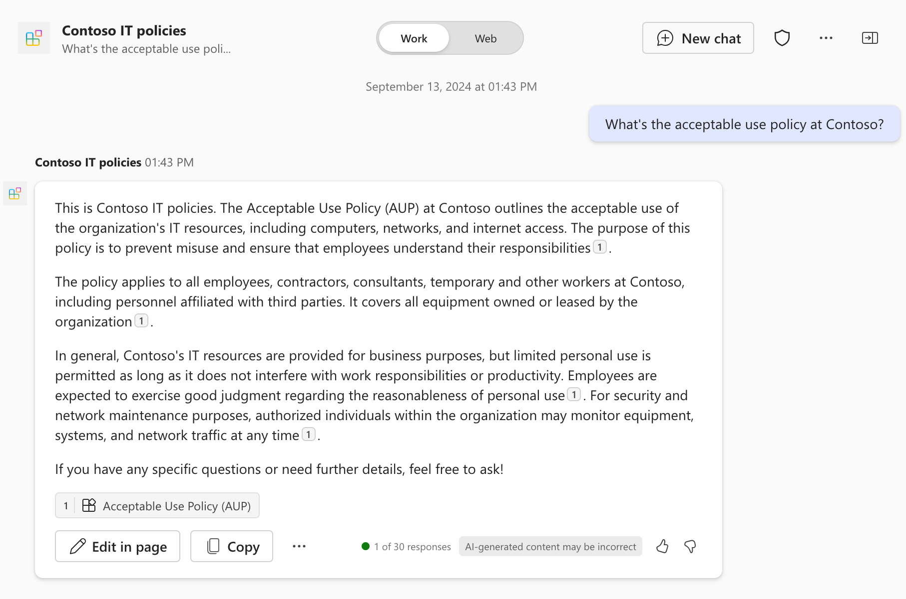

---
lab:
    title: 'Exercise 3 - Test and debug'
    module: 'LAB 04: Add custom knowledge to declarative agents using Microsoft Graph connectors and Visual Studio Code'
---

# Exercise 3 - Test and debug

In this exercise, you will test and deploy your declarative agent to Microsoft 365 and test it using Microsoft 365 Copilot Chat.

### Exercise Duration

- **Estimated Time to complete**: 5 minutes

## Task 1 - Test the declarative agent in Microsoft 365 Copilot

To test your declarative agent, deploy it as an app to your Microsoft 365 tenant. After opening it in Microsoft 365 Copilot, verify that it works as intended.

In Visual Studio Code:

1. In the **Activity Bar** (side bar), open the **Teams Toolkit** extension.
1. From the **Lifecycle** pane, choose **Provision**. Teams Toolkit packages the declarative agent project as an app and uploads it to Microsoft 365.
1. Open a web browser.

In a web browser:

1. Navigate to [https://www.microsoft365.com/chat](https://www.microsoft365.com/chat).
1. Sign in with your work account that belongs to your Microsoft 365 tenant.
1. In Microsoft 365 Copilot, in the side panel, select the **Contoso IT Policies** agent to activate it.
1. In the chat text box, ask `What's the acceptable use policy at Contoso?`.
1. Wait for the agent to respond. Notice how the reply includes references to external content that the Graph connector ingested. The URL in each reference points to the location in the external system where the content is stored.

    